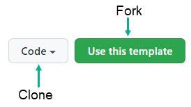

# Working with DateOnly and TimeOnly (C#)

This repository demonstrates simple usage of [DateOnly Struct](https://docs.microsoft.com/en-us/dotnet/api/system.dateonly?view=net-6.0) done with a prerelease product.



There is a [class project](https://github.com/karenpayneoregon/dataonly-timeonly/blob/master/FileLibrary/Classes/Operations.cs) which is responsible for reading a json file with type Person class into a list using [System.Text.Json. JsonSerializer.Deserialize](https://docs.microsoft.com/en-us/dotnet/api/system.text.json?view=net-5.0). In the unit test project this data is tested as instances of the Person class.

## Extension

To convert a DateOnly variable to a DateTime we use ToDateTime which requires a TimeOnly so to keep code light here is a lazy [extension](https://github.com/karenpayneoregon/dataonly-timeonly/blob/master/FileLibrary/LanguageExtensions/DateOnlyExtensions.cs) which default to mid-night or allows changing hours and/or minutes.

```charp
public static DateTime ToDateTime(this DateOnly sender, int hour = 0, int minutes = 0)
    => sender.ToDateTime(new TimeOnly(hour, minutes));
```


## Remarks

- File scoped namespaces feature from C# 10 won't work
- To use DateOnly and TimeOnly install [SDK 6x](https://dotnet.microsoft.com/download/dotnet/6.0?WT.mc_id=DT-MVP-5002866)
- If using `VS2019` for desktop projects
  - Set Use previews as shown in the image below
  - Set `TargetFramework` to `net6.0-windows`

```xml
<Project Sdk="Microsoft.NET.Sdk">

  <PropertyGroup>
	  <LangVersion>9.0</LangVersion>
	  <TargetFramework>net6.0-windows</TargetFramework>
  </PropertyGroup>

</Project>
```

- Currently no code samples for [TimeOnly](https://docs.microsoft.com/en-us/dotnet/api/system.timeonly?view=net-6.0) which will follow shortly.

## See also

- [Developers can benefit from enhanced Date and Time types and Timezone support](https://github.com/dotnet/runtime/issues/45318)
- NodaTime [ZonedDateTime](https://nodatime.org/2.4.x/api/NodaTime.ZonedDateTime.html)


